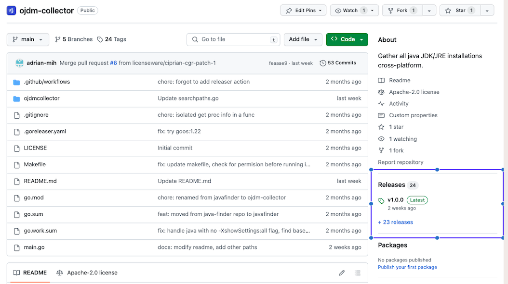
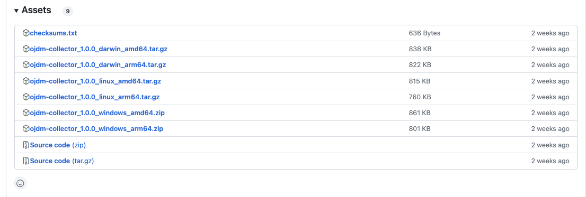

# Licenseware ODJM Collector

<!-- START doctoc generated TOC please keep comment here to allow auto update -->
<!-- DON'T EDIT THIS SECTION, INSTEAD RE-RUN doctoc TO UPDATE -->

- [Introduction](#introduction)
- [How to download](#how-to-download)
  - [Homebrew (macOS / Linux)](#homebrew-macos--linux)
  - [Release assets](#release-assets)
- [How to use](#how-to-use)
  - [Optional arguments](#optional-arguments)
- [Collected data](#collected-data)
- [Searched paths](#searched-paths)
- [Debug log](#debug-log)
- [Troubleshooting](#troubleshooting)
- [Mentions](#mentions)

<!-- END doctoc -->

## Introduction
This program is designed to search for Java installations on the machine where it's running, collect information about the machine and the Java installations and generate a CSV report. It uses the jinfo and jps binaries found in most Java JDKs to connect to the JVM and collect data on running processes. If the binaries are not found, only information on installed Java instances is collected. There is no dependency to a certain JDK vendor or version to run this program.

## How to download

### Homebrew (macOS / Linux)

    brew install licenseware/tap/ojdm-collector

Upgrade later with `brew upgrade ojdm-collector`.

### Release assets

Go to the [GitHub Release](https://github.com/licenseware/ojdm-collector/releases/latest) page on the right side bar

Then using `Assets` select the right package for your operating system and cpu architecture,
naming convention is `ojdm-collector-version_os_architecture`

## How to use

On Windows:
`ojdm-collector.exe`

On Linux / MacOS:
`./ojdm-collector`

Running the tool on Linux may require to first make it executable by running
`chmod +x ojdm-collector`

The report.csv file will be generated in the location from which the program was executed

### Optional arguments
    -output-path string
            Optional: Path to csv report. (default "report.csv")

    -search-paths string
            Optional: List of paths separated by comma where to search for java info.

    -search-paths-file string
            Optional: Path to a file containing additional search paths, one path per line.

    -log-path string
            Optional: Path to the debug log. Defaults to a logs/ directory beside the csv report.

    -log-level string
            Optional: Console verbosity (debug, info, warn, error). The debug log always records everything. (default "info")

    $ ojdm-collector -output-path=/path/to/csvreport.csv
    $ ojdm-collector -search-paths=/home,/oracle,/opt
    $ ojdm-collector -search-paths-file=/path/to/search-paths.txt
    $ ojdm-collector -search-paths=/home,/usr,/opt -output-path=/path/to/csvreport.csv
    $ ojdm-collector -log-path=/path/to/debug.log -log-level=debug

Search paths from `-search-paths` and `-search-paths-file` are added to the default searched paths. They do not replace the defaults.

Example `search-paths.txt`:

    # one path per line; blank lines are ignored
    /opt/custom-java
    /mnt/shared/java
    /Volumes/shared-java
    \\server\share\java

## Collected data
| HostName | DynLibBinPath                                                       | JavaBinPath                                                   | JavaCBinPath                              | IsJDK | JavaHome                                         | JavaRuntimeName                 | JavaRuntimeVersion | JavaVendor         | JavaVersion | JavaVersionDate | JavaVMName                        | JavaVMVendor       | JavaVMVersion    | ProcessPath                                                                                                                       | ProcessRunning | CommandLine                                                                         | HostLogicalProcessors |
|----------|---------------------------------------------------------------------|---------------------------------------------------------------|-------------------------------------------|-------|--------------------------------------------------|---------------------------------|--------------------|--------------------|-------------|-----------------|-----------------------------------|--------------------|------------------|-----------------------------------------------------------------------------------------------------------------------------------|----------------|-------------------------------------------------------------------------------------|-----------------------|
| Reactor1 | C:\Program Files\Java\jre-9.0.4\bin\server\jvm.dll                  | C:\Program Files\Java\jre-9.0.4\bin\java.exe                  |                                           | false | C:/Program Files/Java/jre-9.0.4                  | Java(TM) SE Runtime Environment | 9.0.4+11           | Oracle Corporation | 9.0.4       |                 | Java HotSpot(TM) 64-Bit Server VM | Oracle Corporation | 9.0.4+11         | C:/Users/Administrator/Documents/ojdm-collector/apache-tinkerpop-gremlin-console-3.7.1-bin/apache-tinkerpop-gremlin-console-3.7.1 | true           | org.apache.tinkerpop.gremlin.console.Console -Xms32m -Xmx512m -Djline.terminal=none | 24                    |
| Reactor1 | C:\Program Files\Java\jdk-9.0.4\bin\server\jvm.dll                  | C:\Program Files\Java\jdk-9.0.4\bin\java.exe                  | C:/Program Files/Java/jdk-9.0.4/bin/javac | true  | C:/Program Files/Java/jdk-9.0.4                  | Java(TM) SE Runtime Environment | 9.0.4+11           | Oracle Corporation | 9.0.4       |                 | Java HotSpot(TM) 64-Bit Server VM | Oracle Corporation | 9.0.4+11         |                                                                                                                                   | false          |                                                                                     | 24                    |
| Reactor1 | C:\Program Files\Java\jdk-21\bin\server\jvm.dll                     | C:\Program Files\Java\jdk-21\bin\java.exe                     | C:/Program Files/Java/jdk-21/bin/javac    | true  | C:/Program Files/Java/jdk-21                     | Java(TM) SE Runtime Environment | 21.0.1+12-LTS-29   | Oracle Corporation | 21.0.1      | 2023-10-17      | Java HotSpot(TM) 64-Bit Server VM | Oracle Corporation | 21.0.1+12-LTS-29 |                                                                                                                                   | false          |                                                                                     | 24                    |
| Reactor1 | C:\Program Files\Zulu\zulu-21\bin\server\jvm.dll                    | C:\Program Files\Zulu\zulu-21\bin\java.exe                    | C:/Program Files/Zulu/zulu-21/bin/javac   | true  | C:/Program Files/Zulu/zulu-21                    | OpenJDK Runtime Environment     | 21.0.1+12-LTS      | Azul Systems, Inc. | 21.0.1      | 2023-10-17      | OpenJDK 64-Bit Server VM          | Azul Systems, Inc. | 21.0.1+12-LTS    |                                                                                                                                   | false          |                                                                                     | 24                    |
| Reactor1 | C:\Program Files\Java\jdk-19\bin\server\jvm.dll                     | C:\Program Files\Java\jdk-19\bin\java.exe                     | C:/Program Files/Java/jdk-19/bin/javac    | true  | C:/Program Files/Java/jdk-19                     | Java(TM) SE Runtime Environment | 19.0.2+7-44        | Oracle Corporation | 19.0.2      | 2023-01-17      | Java HotSpot(TM) 64-Bit Server VM | Oracle Corporation | 19.0.2+7-44      |                                                                                                                                   | false          |                                                                                     | 24                    |
| Reactor1 | C:\Users\Administrator\AppData\Local\DBeaver\jre\bin\server\jvm.dll | C:\Users\Administrator\AppData\Local\DBeaver\jre\bin\java.exe |                                           | false | C:/Users/Administrator/AppData/Local/DBeaver/jre | OpenJDK Runtime Environment     | 17.0.6+10          | Eclipse Adoptium   | 17.0.6      | 2023-01-17      | OpenJDK 64-Bit Server VM          | Eclipse Adoptium   | 17.0.6+10        |                                                                                                                                   | false          |                                                                                     | 24                    |
| Reactor1 | C:\Program Files\Java\jdk1.8.0_202\jre\bin\server\jvm.dll           | C:\Program Files\Java\jdk1.8.0_202\jre\bin\java.exe           |                                           | false | C:/Program Files/Java/jdk1.8.0_202/jre           | Java(TM) SE Runtime Environment | 1.8.0_202-b08      | Oracle Corporation | 1.8.0_202   |                 | Java HotSpot(TM) 64-Bit Server VM | Oracle Corporation | 25.202-b08       |                                                                                                                                   | false          |                                                                                     | 24                    |
| Reactor1 | C:\Program Files\Java\jre1.8.0_202\bin\server\jvm.dll               | C:\Program Files\Java\jre1.8.0_202\bin\java.exe               |                                           | false | C:/Program Files/Java/jre1.8.0_202               | Java(TM) SE Runtime Environment | 1.8.0_202-b08      | Oracle Corporation | 1.8.0_202   |                 | Java HotSpot(TM) 64-Bit Server VM | Oracle Corporation | 25.202-b08       |                                                                                                                                   | false          |                                                                                     | 24                    |

## Searched paths

The collector also supports scanning external locations such as mapped drives, mounted volumes, and network shares, but users must pass those locations as additional paths with `-search-paths` or `-search-paths-file`.

Additional path examples:

    $ ojdm-collector -search-paths=/mnt/shared/java,/opt/custom-java
    $ ojdm-collector -search-paths-file=/etc/ojdm-collector/search-paths.txt
    $ ojdm-collector.exe -search-paths="Z:\Java,\\server\share\java"

Example `search-paths.txt` file:

    # one path per line; blank lines are ignored
    /opt/custom-java
    /mnt/shared/java
    /Volumes/shared-java
    \\server\share\java

By default the program searches for Java installations in several specific local locations depending on the operating system.

On Windows:
* C:\\Program Files
* C:\\Program Files (x86)
* AppData\\Local for detected user profiles
* ALLUSERSPROFILE\\AppData\\Local when available

On Linux:
* /home
* /usr/bin
* /usr/local
* /usr/lib
* /usr/share
* /opt
* /snap
* /oracle
* /bin
* ~/.local/share

On MacOs:
* /Applications

## Debug log
Every run writes a structured JSON log next to the csv report, so a report that
looks wrong can be explained without reproducing it:

    report.csv
    logs/
        debug.log

It records the search paths used, every installation found, and every path that
could not be read, including whether the failure was a permission error:

    {"level":"warn","error":"CreateFile C:\\Program Files (x86)\\...: Access is denied.","permission_denied":true,"path":"...","message":"skipping unreadable path"}

A path skipped this way is not scanned, so an installation underneath it is
absent from the report. If the csv looks incomplete, read the warnings first.

The console shows the same events at `info` and above; the file always keeps
`debug` detail. A previous `debug.log` is preserved as `debug-<timestamp>.log`
rather than overwritten, so re-running after a failure does not destroy the
evidence of the failing run.

When reporting an issue, attach the whole `logs/` directory alongside the csv.

## Troubleshooting
If no running processes are identified, it may be because the jinfo and jps utilities could not be found on any of the discovered java installations. The easiest way to fix this is to place an OpenJDK in any of the default search paths or to include the location of the OpenJDK in the additional search paths.

## Mentions
Thanks to the Azul JDowser product which served as the inspiration for this tool.
